# 5374.jp -Sakaiminato- 操作マニュアル

## 動作保証環境

当アプリは下記の環境での動作のみ保証しております。

- Google Chrome
- Mozilla FireFox
- Microsoft Edge
- Safari
- iOS Safari

※Internet Explorerをご利用の方はEdge、またはChromeでご覧ください。

## 設定情報保存について

Safariの場合、設定情報を保存するCookieをブロックする設定が初期状態でオンになっている可能性があります。

設定が保存されない場合は、下記の箇所を確認してください。

- iPhone、iPadの場合
  1. ホーム画面から「設定」を選択
  2. 「Safari」を選択
  3. 「Cookie をブロック」を選択
  4. 「アクセス中のWebサイトのみ許可」、「訪問したWebサイトを許可」または「常に許可」のいずれかを選択

- macOSの場合
  1. 「Safari」を起動します。 「Safari」をクリック 「環境設定」をクリック
  2. 「セキュリティ」をクリック 「Cookieの受け入れ」の 「訪問したページのサーバからのみ受け入れる」を選択 「クローズボタン」をクリック 以上で、「Cookieの設定方法」は終了です。

## 初期設定

### 1. 言語設定
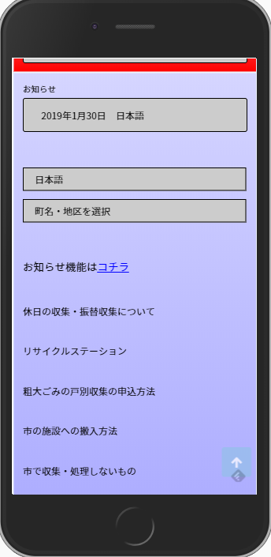

アクセスしたとき最初はこちらの画面が表示されます。  
ブラウザの設定から言語設定が行われます。  
異なる言語で使用する場合は「言語設定ボックス」※画面上の「日本語」で言語を切り替えてください。

### 2. エリア設定
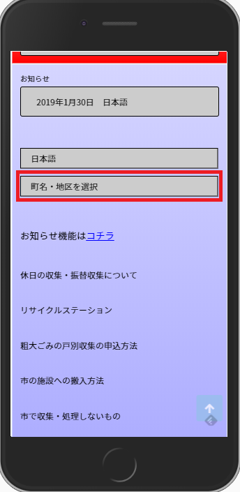

赤枠で囲われたボックスをタップして町名・地区を選択します。

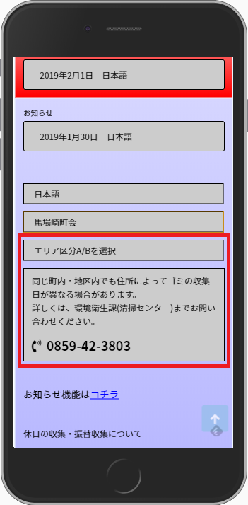

エリアによってはA/B区分で収集日が異なる事があります。  
その場合は環境衛生課（清掃センター）にお問い合わせの上、A/B区分を設定してください。

### 3. カレンダー表示

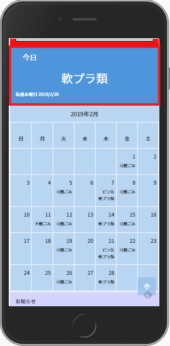

エリア設定が完了すると当月の収集カレンダーが表示されます。  
なお当日収集が行われるゴミがある場合、赤枠の位置に当日収集分が表示されます。

## メニューの利用

### 1. ページトップへの移動※ページトップが表示されている場合は2.へ
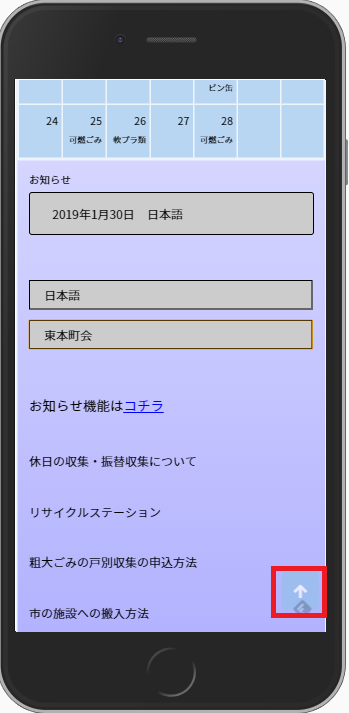

赤枠のボタンをタップしてページのトップへ移動します。  
ボタンは常時右下に表示されているので、好きなときにページ上まで戻ることができます。

### 2. メニューを開く
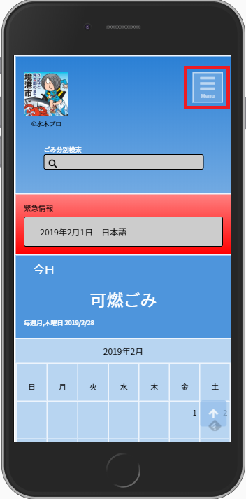

赤枠で囲われた、メニューボタンをタップしてメニューを開きます。

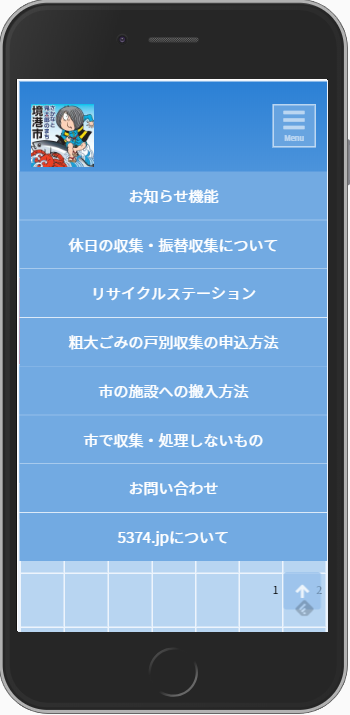

ご覧になりたい項目をタップして該当項目へ移動します。  
移動と同時に該当項目が表示されます。  
タイトル部分をタップすると項目を開閉することが出来ます。

## お知らせ

### 1. お知らせの表示
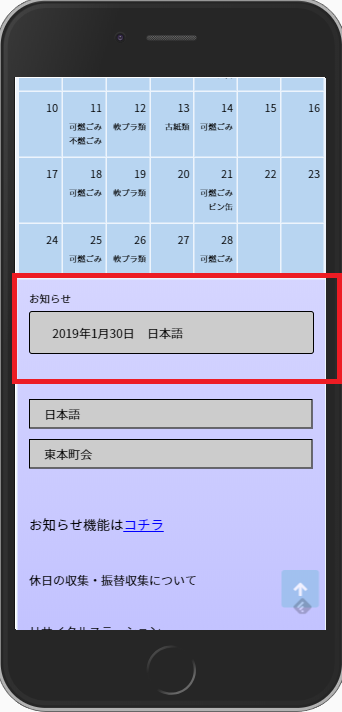

お知らせがある場合、カレンダー下の赤枠の位置に表示されます。  
日付が新しいものから順に表示されます。

### 2. お知らせを開く
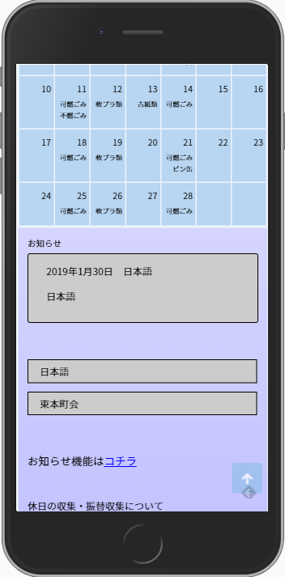

お知らせの枠をタップすると、タップしたお知らせの内容を閲覧出来ます。  
もう一度タップすることで閉じることも可能です。

## 緊急情報

### 1. 緊急情報の表示
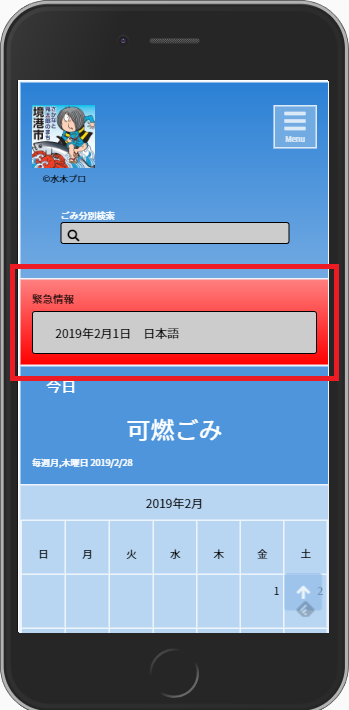

緊急情報がある場合はカレンダー上の赤枠の部分に表示されます。  
お知らせ同様に、タップすることで内容を閲覧出来ます。

## ゴミ分別検索

### 1. ゴミ分別検索について
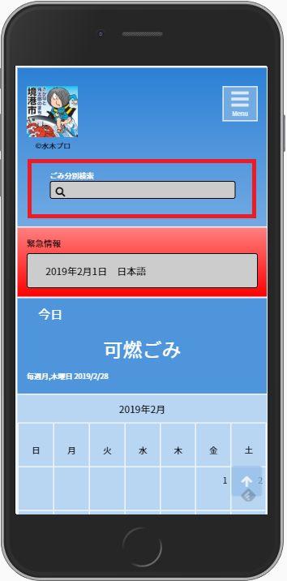

赤枠の部分でゴミ検索を利用することが出来ます。  
灰色のボックスをタップして
**ひらがな**
で検索したいワードを入力してください。

### 2. 検索結果の表示
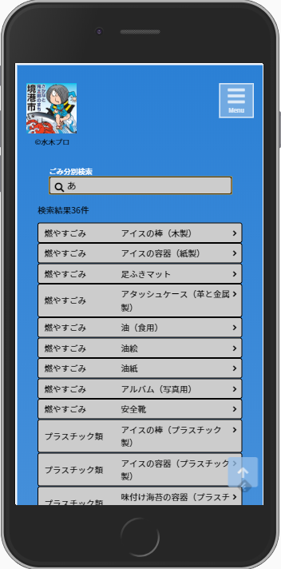

該当する項目がある場合、検索結果件数と該当項目一覧が表示されます。

### 3. 分別の注意点表示
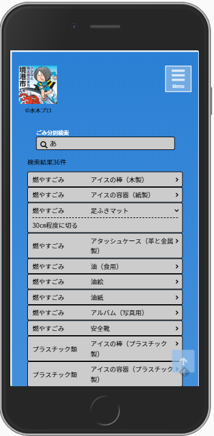

項目をタップすると分別の注意点が表示されます。  
もう一度タップすることで閉じることが出来ます。

## このアプリについて
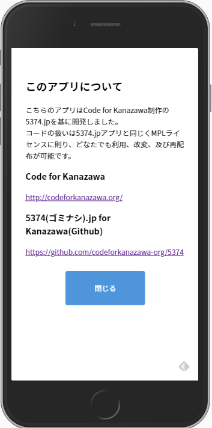

こちらのアプリはCode for Kanazawa制作の5374.jpを基に開発しました。  
コードの扱いは5374.jpアプリと同じくMPLライセンスに則り、どなたでも利用、改変、及び再配布が可能です。

### Code for Kanazawa
[http://codeforkanazawa.org/](http://codeforkanazawa.org/)

### 5374(ゴミナシ).jp for Kanazawa(Github)
[https://github.com/codeforkanazawa-org/5374](https://github.com/codeforkanazawa-org/5374)

## リリースノート
リリースノートは[コチラ](./manu/release-notes.md)

## データについて
各データ、データの作成については[コチラ](./manu/create_data.md)